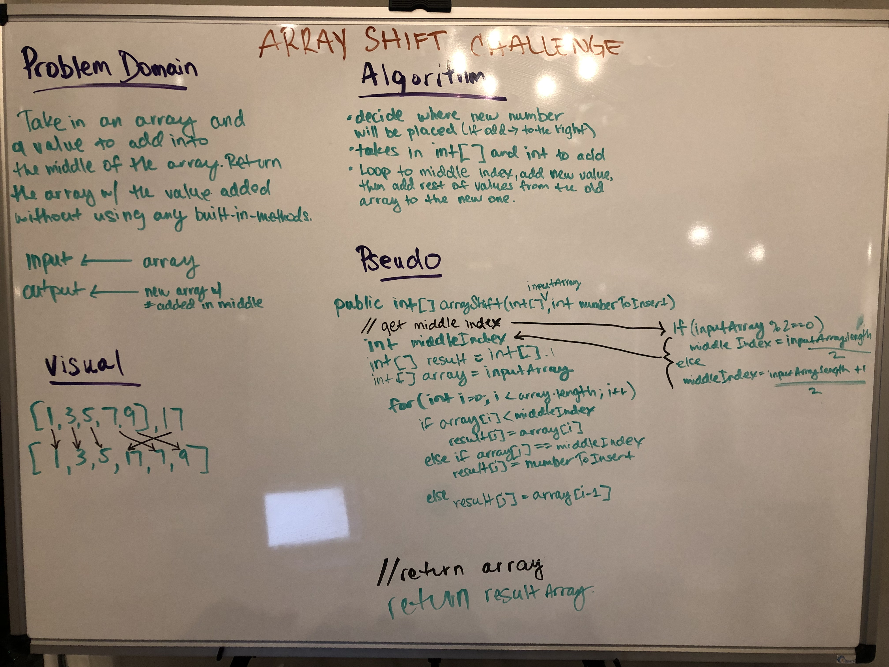

# Array Shift Summary

## Challenge Description
Create a method that takes in an array and a value to add into the middle of the array. Return a new array with the value added without using any built-in methods.

## Approach & Efficiency
I defined what my middle index needs to be based on if the length of the input array is an odd or even number. Then I looped through the input array and added each value into a new array until I reached the middle index. Then entered the new value into that middle index and added into the new array. The subsequent values were then also added to the new array.

Time complexity is O(N).
Space complexity is O(N).

## Solution

[Link to Code](./src/main/java/array_shift/Library.java)

[Link to Test Code](./src/test/java/array_shift/LibraryTest.java)

