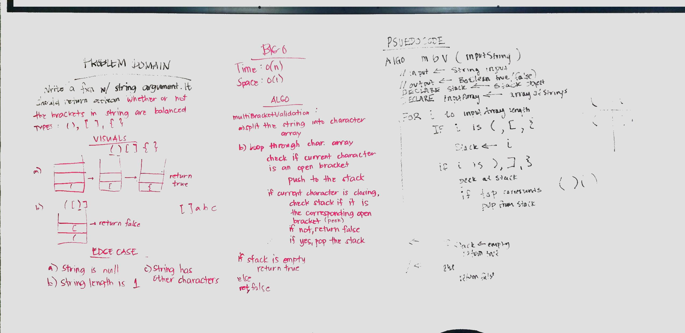

# Multi Bracket Validation

## Challenge Description
Validate brackets ({}, (), []) if balanced or not.

## Approach & Efficiency
* The approach is to put the open brackets to the stack while traversing the character array. If the character is  the closing bracket, check the stack if it is the corresponding pair. To determine if it is the correct pair, the HashMap is utilized. 
 

## Big O
* Time is O(n)
* Space is O(n)

## API
multiBracketValidation()

initializeBrackets()

## Solution

[Link to Code](./src/main/java/multi_bracket_validation/App.java)

[Link to Test Code](./src/test/java/multi_bracket_validation/AppTest.java)

