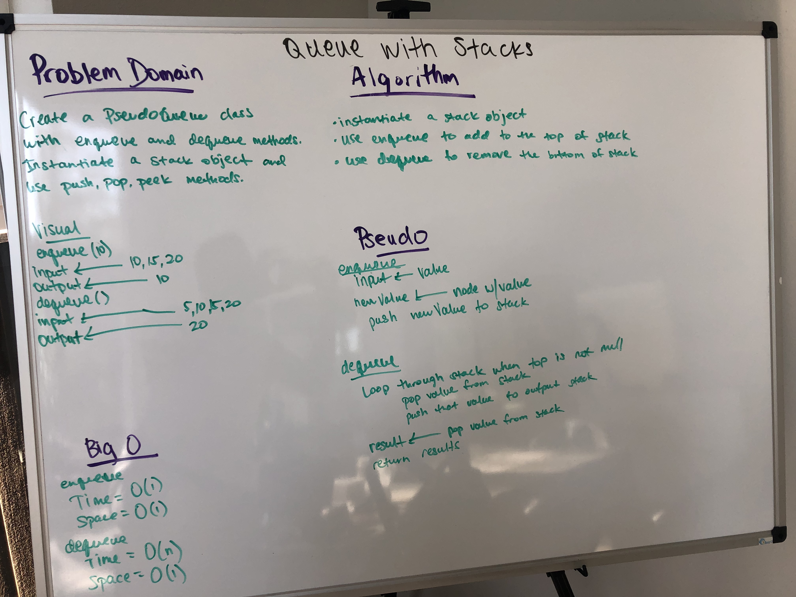

# Queues with Stacks

## Challenge Description
Create a PseudoQueue class with enqueue and dequeue methods. Instantiate a stack object and use push, pop, peek methods to manipulate the stack.

## Approach & Efficiency

**enQueue**
* Time is O(1)
* Space is O(1)

**deQueue**
* Time is O(n)
* Space is O(1)

## API
enqueue()

deQueue()

## Solution

[Link to Code](./src/main/java/queue_with_stacks/PseudoQueue.java)

[Link to Test Code](./src/test/java/queue_with_stacks/PseudoQueueTest.java)

